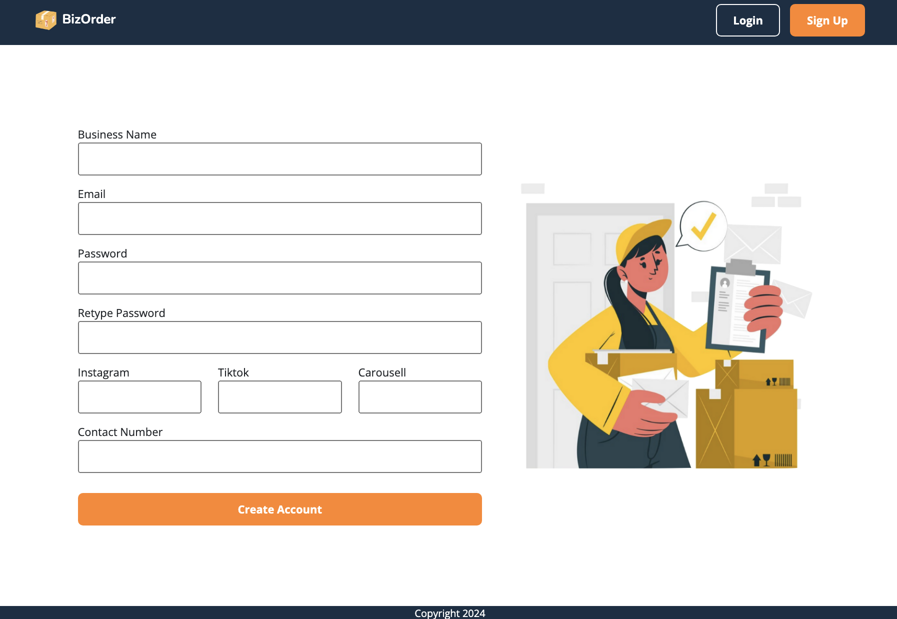
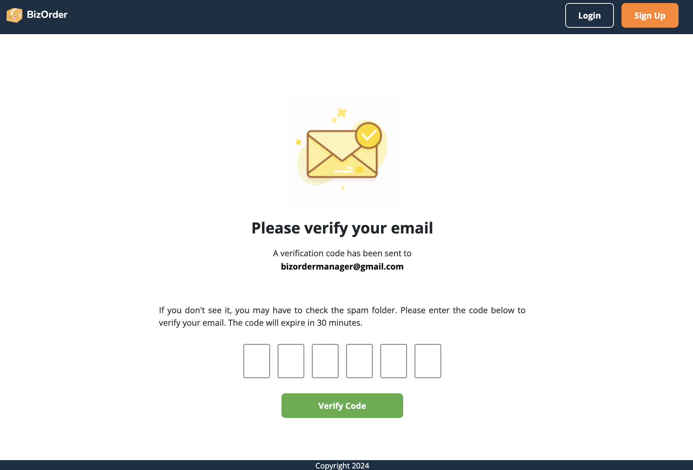
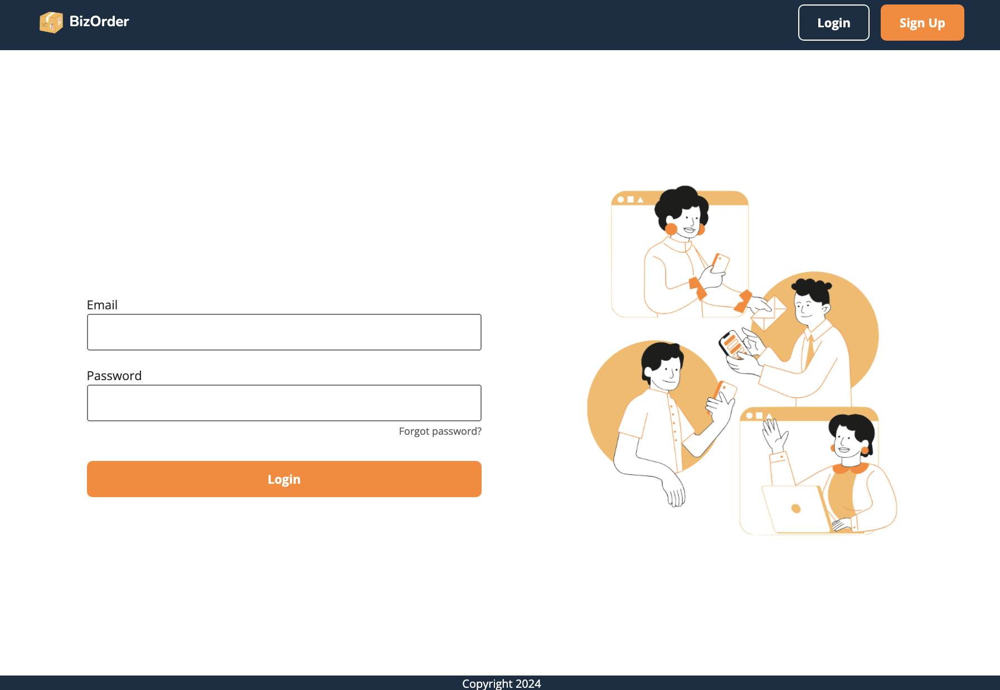
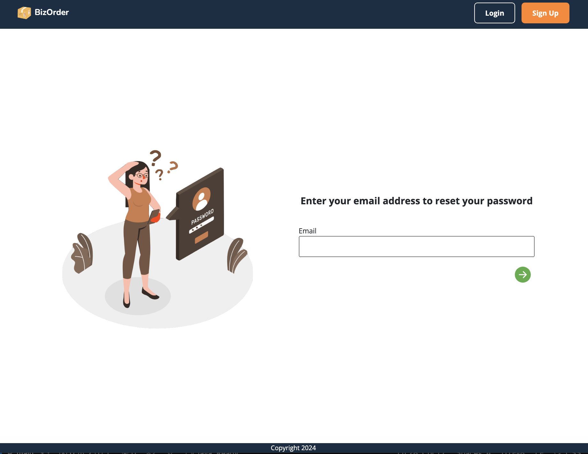
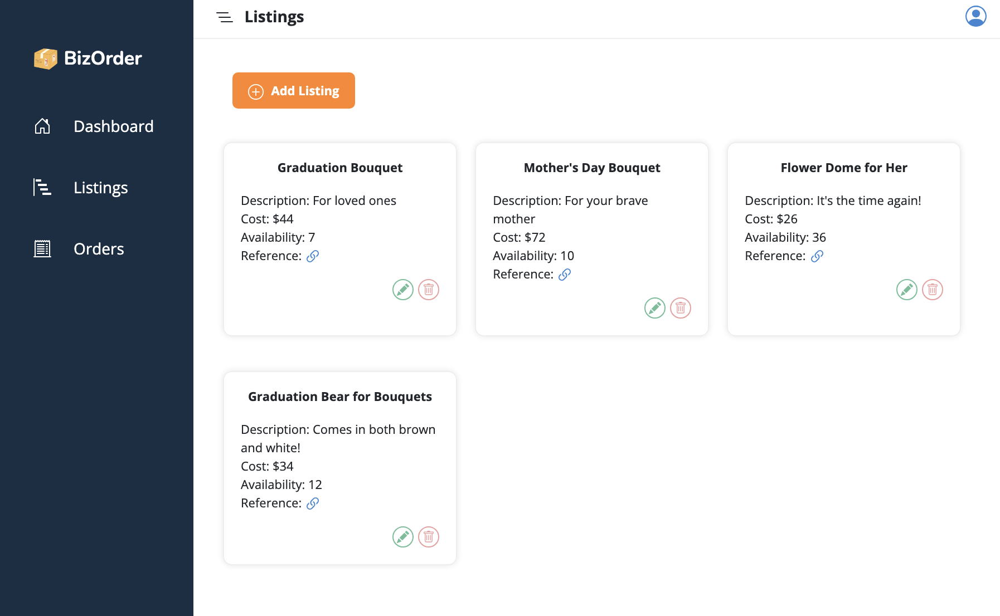
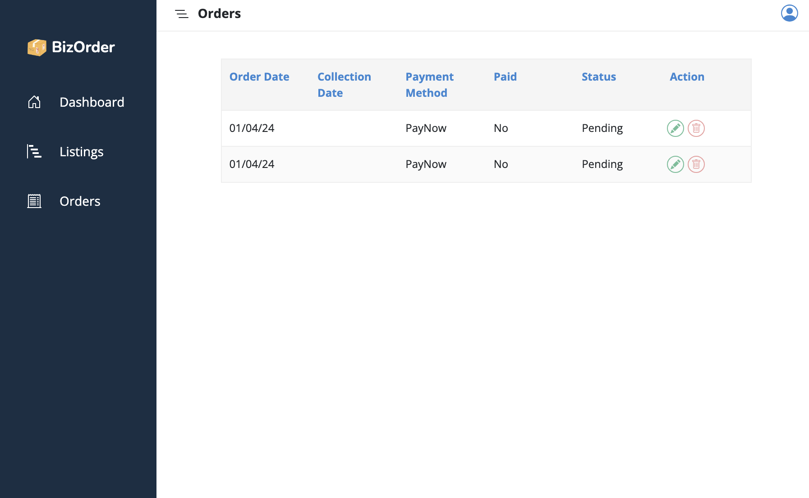
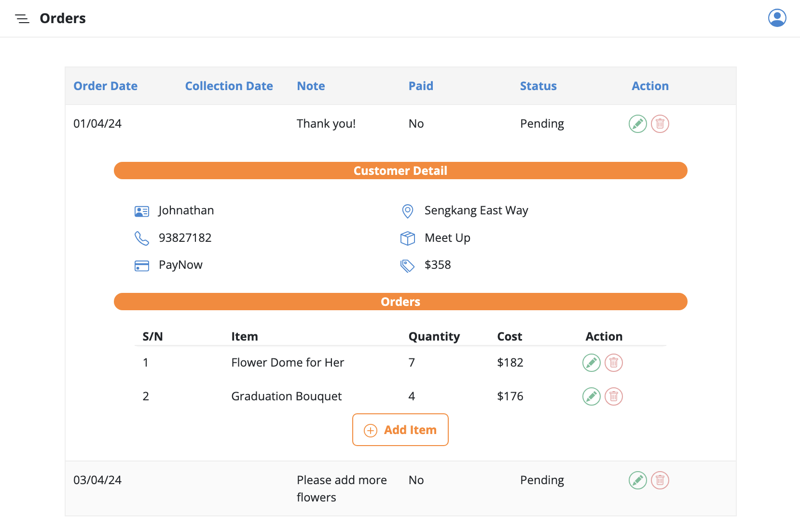

# Business Management System

## Project Introduction
This project aims to solve the pain points of small business owners by providing a system to keep track of customer orders. The system allows customers to interact with a Telegram bot to view order details, place orders, and check product availability. Business owners can manage orders, update inventory, and add new products via a frontend dashboard.

## Software Requirements Specifications 
This section describes the requirements for the software project. The created software must be
able to perform the following functional requirements (abbreviated as FR):

**FR 1: Product Management**
- a. FR 1.1: Business owners can add new products for sale.
- b. FR 1.2: Business owners can update product information, such as name, description, and price.
- c. FR 1.3: Business owners can delete product listings.

**FR 2: Order Management**
- a. FR 2.1: Business owners can view orders placed by customers.
- b. FR 2.2: Business owners can update order status (paid/unpaid, completed/pending).
- c. FR 2.3: Business owners can add, delete, or update items within orders.
- d. FR 2.4: Customers can view their order details and track order status through the Telegram bot.

**FR 3: Customer Interaction via Telegram Bot**
- a. FR 3.1: Customers can access the Telegram bot to place orders.
- b. FR 3.2: Customers can select items they want to order from the bot's menu.
- c. FR 3.3: Customers can check product availability through the Telegram bot.
- d. FR 3.4: Business owners can integrate the Telegram bot with their social media platforms for customer orders.

## Frontend Design

**Homepage**

**Sign Up Page**

**Verification Page**

**Login Page**

**Forgot Password Page**

**Product Listing Page**

**Consolidation of Orders**

**Order Details**

## Telegram Bot

## Technologies Used

- **Frontend**:
  - Angular
  
- **Backend**:
  - Spring Boot
  
- **Database**:
  - MySQL
  
- **Integration**:
  - Telegram Bot 
    - Telegram Bot API
    - Node.js
    - Express

## Future Implementations

### 1. Two-Factor Authentication (2FA)
Enhance security measures by implementing Two-Factor Authentication (2FA) to protect user accounts. This additional layer of security requires users to verify their identity through a second factor, mobile device, before gaining access to the system.

### 2. Sales Data Analysis Dashboard
Introduce a dashboard feature to analyze sales data effectively. This dashboard will provide insights into sales performance by comparing current month orders with the previous month. It will break down sales by items to identify which products generate the most profit, allowing for informed decision-making and strategic planning.
