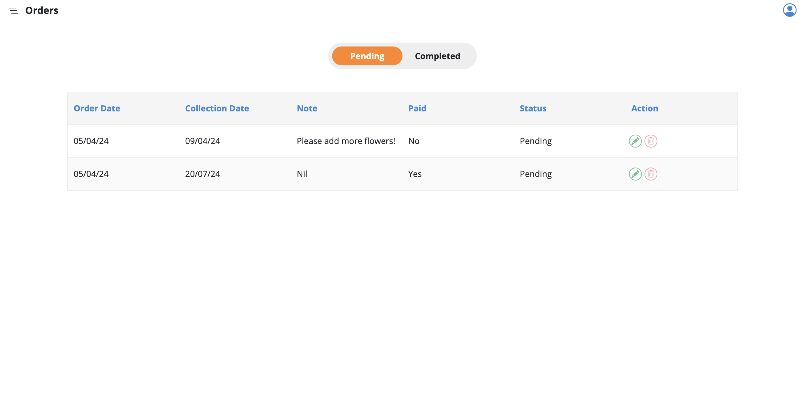
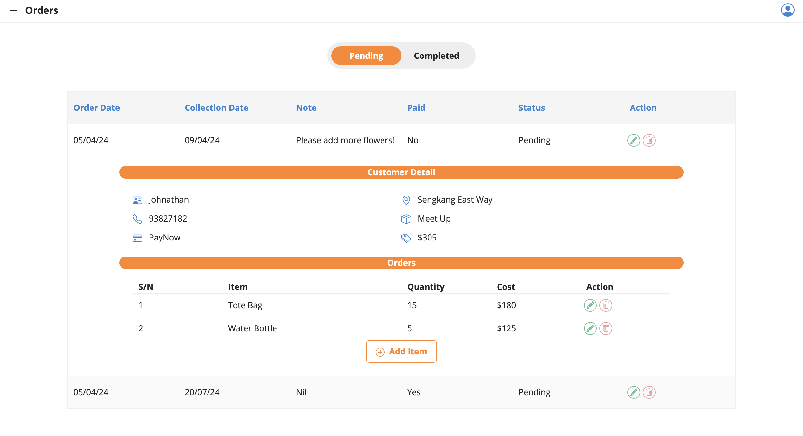
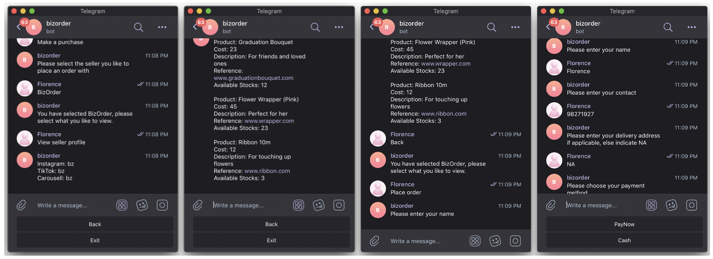
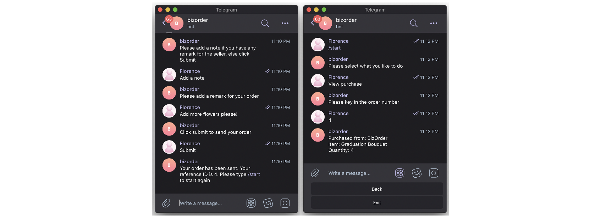
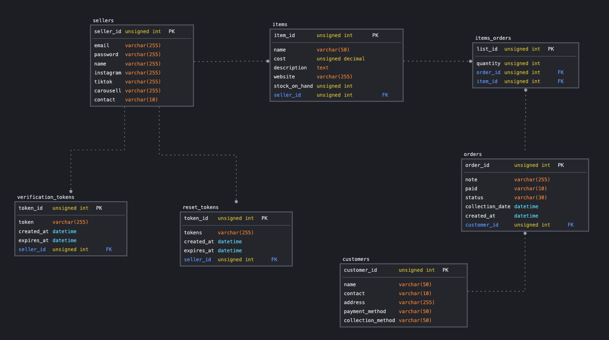

# BizOrder Management System

## Project Introduction
This project aims to solve the pain points of small business owners by providing a system to keep track of customer orders. The system allows customers to interact with a Telegram bot to view order details, place orders, and check product availability. Business owners can manage orders, update inventory, and add new products via a frontend dashboard.

- GitHub Repository for Backend (Spring Boot): <a href="https://github.com/christiinelim/bizorder-backend">Link</a>
- GitHub Repository for Telegram Bot (NodeJS): <a href="https://github.com/christiinelim/bizorder-telegram">Link</a>

## Software Requirements Specifications 
This section describes the requirements for the software project. The created software must be
able to perform the following functional requirements (abbreviated as FR):

**FR 1: Product Management**
- FR 1.1: Business owners can add new products for sale.
- FR 1.2: Business owners can update product information, such as name, description, and price.
- FR 1.3: Business owners can delete product listings.

**FR 2: Order Management**
- FR 2.1: Business owners can view orders placed by customers.
- FR 2.2: Business owners can update order status (paid/unpaid, completed/pending).
- FR 2.3: Business owners can add, delete, or update items within orders.
- FR 2.4: Customers can view their order details and track order status through the Telegram bot.

**FR 3: Customer Interaction via Telegram Bot**
- FR 3.1: Customers can access the Telegram bot to place orders.
- FR 3.2: Customers can select items they want to order from the bot's menu.
- FR 3.3: Customers can check product availability through the Telegram bot.
- FR 3.4: Business owners can integrate the Telegram bot with their social media platforms for customer orders.

## Frontend Design

**Homepage**

**Sign Up Page**

**Verification Page**

**Login Page**

**Forgot Password Page**

**Product Listing Page**

**Consolidation of Orders**

**Order Details**

## Telegram Bot

## Technologies Used

- **Frontend**:
  - Angular
  
- **Backend**:
  - Spring Boot
  
- **Database**:
  - MySQL
  
- **Integration**:
  - Telegram Bot 
    - Telegram Bot API
    - Node.js
    - Express
  - Axios
  - JSON Web Token

## ER Diagram

## SQL Schema

## Future Implementations

### 1. Sales Data Analysis Dashboard
Introduce a dashboard feature to analyze sales data effectively. This dashboard will provide insights into sales performance by comparing current month orders with the previous month. It will break down sales by items to identify which products generate the most profit, allowing for informed decision-making and strategic planning.

### 2. Two-Factor Authentication (2FA)
Enhance security measures by implementing Two-Factor Authentication (2FA) to protect user accounts. This additional layer of security requires users to verify their identity through a second factor, mobile device, before gaining access to the system.

## Backend API Reference

### Endpoints

#### AccountController API Reference

| Endpoint                    | Method | Description                           | Request Body         | Response Body         |
|-----------------------------|--------|---------------------------------------|----------------------|-----------------------|
| /api/account                | GET    | Get all accounts                      | None                 | List of Account objects |
| /api/account/{accountId}    | GET    | Get account by ID                     | None                 | Account object        |
| /api/account/{accountId}    | PUT    | Update account                        | Account object       | Updated Account object |
| /api/account/{accountId}    | DELETE | Delete account                        | None                 | None                  |

#### AuthenticationController API Reference

| Endpoint                         | Method | Description                                | Request Body                 | Response Body           |
|----------------------------------|--------|--------------------------------------------|------------------------------|-------------------------|
| /api/auth/signup                 | POST   | Register a new user account                | Account object               | Verification message     |
| /api/auth/login                  | POST   | Log in an existing user                    | LoginAccountDto object       | Authentication token     |
| /api/auth/verify                 | POST   | Verify user account                        | VerifyAccountRequest object  | Verification message     |
| /api/auth/forgot-password        | POST   | Send reset email for forgotten password    | ForgotPasswordRequest object | Email confirmation      |
| /api/auth/reset-password         | POST   | Reset user password                        | ResetPasswordRequest object  | Password reset message  |

#### CustomerController API Reference

| Endpoint                    | Method | Description                            | Request Body    | Response Body           |
|-----------------------------|--------|----------------------------------------|-----------------|-------------------------|
| /api/customer/{customerId} | GET    | Get details of a specific customer     | N/A             | Customer details        |
| /api/customer/              | GET    | Get details of all customers           | N/A             | List of customers       |
| /api/customer/              | POST   | Create a new customer                  | Customer object | Success message         |
| /api/customer/{customerId} | PUT    | Update details of a specific customer  | Customer object | Success message         |
| /api/customer/{customerId} | DELETE | Delete a specific customer             | N/A             | Success message         |

#### ItemController API Reference

| Endpoint                          | Method | Description                               | Request Body | Response Body       |
|-----------------------------------|--------|-------------------------------------------|--------------|---------------------|
| /api/item/                        | GET    | Get details of all items                  | N/A          | List of items       |
| /api/item/{itemId}                | GET    | Get details of a specific item            | N/A          | Item details        |
| /api/item/account/{accountId}     | GET    | Get items associated with a specific account | N/A       | List of items       |
| /api/item/                        | POST   | Create a new item                         | Item object  | Success message     |
| /api/item/{itemId}                | PUT    | Update details of a specific item         | Item object  | Success message     |
| /api/item/{itemId}                | DELETE | Delete a specific item                    | N/A          | Success message     |

#### ItemOrderController API Reference

| Endpoint                      | Method | Description                               | Request Body | Response Body       |
|-------------------------------|--------|-------------------------------------------|--------------|---------------------|
| /api/purchase/{purchaseId}    | GET    | Get details of a specific purchase        | N/A          | Purchase details    |
| /api/purchase/order/{orderId} | GET    | Get items associated with a specific order | N/A          | Order details       |
| /api/purchase/                | POST   | Create a new purchase                     | Purchase object | Success message     |
| /api/purchase/{purchaseId}    | PUT    | Update details of a specific purchase     | Purchase object | Success message     |
| /api/purchase/{purchaseId}    | DELETE | Delete a specific purchase                | N/A          | Success message     |

#### OrderController API Reference

| Endpoint                      | Method | Description                                | Request Body | Response Body       |
|-------------------------------|--------|--------------------------------------------|--------------|---------------------|
| /api/order/                   | GET    | Get details of all orders                  | N/A          | List of orders      |
| /api/order/{orderId}         | GET    | Get details of a specific order            | N/A          | Order details       |
| /api/order/account/{accountId}| GET    | Get all orders associated with a customer  | N/A          | List of orders      |
| /api/order/                   | POST   | Create a new order                         | Order object | Success message     |
| /api/order/{orderId}         | PUT    | Update details of a specific order         | Order object | Success message     |
| /api/order/{orderId}         | DELETE | Delete a specific order                    | N/A          | Success message     |

<!-- ## Live Swagger UI
You can access the live Swagger UI [here](http://example.com/swagger-ui) to interact with the API visually. -->

### Swagger UI Screenshots

This screenshot shows the overview of the API endpoints and descriptions.

### License
This API is released under the MIT License. For support or feedback, contact us at bizordermanager@gmail.com.